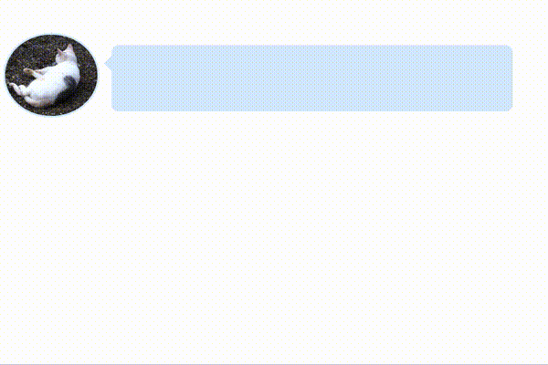

# mini-speech-bubbler




## Usage

Store the avatar image in the `static` directory with the name `avatar.png` or `avatar.jpeg(jpg) ` before running.

**Note:**
Currently only the `png,jpeg(jpg)` format is supported.


Execute this command to access the `http://localhost:3000`.

```bash
go get github.com/shinshin86/mini-speech-bubbler
mini-speech-bubbler
```

If you want to use a single binary, please download from [this Release page](https://github.com/shinshin86/mini-speech-bubbler/releases).


### About speech recognition settings

You can change the speech recognition settings with the query string.

```
http://localhost:3000/ # => Default setting. It will be recognized by the browser's language setting.
http://localhost:3000/?lang=en # => You can set the language to be recognized by parameter of lang.
http://localhost:3000/?realtime=true # => If parameter of realtime is set to true, recognition is done in real time.
http://localhost:3000/?lang=en&realtime=true # => Of course, multiple parameters are accepted.
```


## Development

I use [this package (shogo82148/assets-life)](https://github.com/shogo82148/assets-life) to be able to use it as a single binary.


To generate the package, I'm running this command first.

(You don't have to run this command, but I'm writing it for my own history.)

```bash
assets-life static/ static
```

To regenerate the package, run this command.

```bash
go generate ./static
```

Running then access to `http://localhost:3000`.

```bash
go run main.go
```

